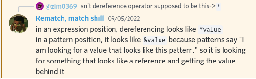

# Common Programming Concepts

## Mutability

```rust
{{#rustdoc_include ../listings/03_common_concepts/l01-variables-are-immutable/src/main.rs:here}}
```

<details>
<summary>Error</summary>

```console
{{#include ../listings/03_common_concepts/l01-variables-are-immutable/output.txt}}
```

</details>

The above code doesn't compile. To make it compile we'll have to make "x" mutable using: `let mut x = 5`.

## Constants

*   Always immutable
*   Type of the value **must** be annotated
*   can be declared in any scope
*   can only be set to a constant expression, not the result of a value that could only be computed at runtime. [Read Constant Evaluation](https://doc.rust-lang.org/reference/const_eval.html).
*   always written in uppercase and underscores are used to separate words
*   Example:

```rust
# #![allow(unused)]
# fn main() {
const THREE_HOURS_IN_SECONDS: u32 = 60 * 60 * 3; //set to a constant expression
# }
```

## Shadowing

Let's not waste variable names ; )
We can even change the type of variables

```rust
{{#rustdoc_include ../listings/03_common_concepts/l02-shadowing/src/main.rs:here}}
```

<details>
<summary>Output</summary>

```console
{{#include ../listings/03_common_concepts/l02-shadowing/output.txt}}
```

</details>

## Datatypes

*   Rust has four primary scalar types: integers, float, boolean, and characters.
*   Length of types `isize` & `usize` depends upon the underlying architecture(32bit or 64bit)
*   Each variant of an Integer type can be signed(`i8`) or unsigned(`u8`)
*   Rust’s char type is four bytes in size and represents a Unicode Scalar Value, which means it can represent a lot more than just ASCII.
*   Rust's tuple type: ex- `let tup: (i32, f64, u8) = (500, 6.4, 1);`
*   The tuple without any values has a special name, unit. This value and its corresponding type are both written `()` and represent an empty value or an empty return type. Expressions implicitly return the unit value if they don’t return any other value..
*   Array's in Rust are homogenous `let a: [i32; 5] = [1, 2, 3, 4, 5];`
*   `let a = [3; 5];` crates an array `[3, 3, 3, 3, 3]`

## Invalid Array Element Access

Let's say you have an array in a program with 5 elements and take user input to access a certain element. If the user inputs "6" to access the 6th element which isn't present in the array, Rust will panic during Run Time. This error won't be caught during compilation. Some languages let you access invalid memory but Rust doesn't. It soon panics and exits.

## Functions

*   Type annotations for parameters are mandatory.

<!-- TODO: Add an example function that takes a variety of parameters -->

<details>
<summary>Common</summary>

*   Common functions

    *   `clone()`:
    *   `is_ok()`:
    *   `is_some()`:
    *   `iter()`:
    *   `unwrap()`:

*   Common macros
    *   `format!()`:
    *   `panic!()`:

</details>

## Statements & Expressions

*   Statements are instructions that perform some action and do not return a value. Expressions evaluate to a resulting value. Let’s look at some examples.

## Comments

```rust
// Single line comment
/// Documentation comment
/* Multiline
   Comment */
```

## if else

```rust
{{#rustdoc_include ../listings/03_common_concepts/l03-if-else/src/main.rs:here}}
```

<details>
<summary>Output</summary>

```console
{{#include ../listings/03_common_concepts/l03-if-else/output.txt}}
```

</details>

### Using if in a let statement

```rust
{{#rustdoc_include ../listings/03_common_concepts/l04-if-in-a-let-statement/src/main.rs:here}}
```

<details>
<summary>Output</summary>

```console
{{#include ../listings/03_common_concepts/l04-if-in-a-let-statement/output.txt}}
```

</details>

## Repetition with loops

```rust
{{#rustdoc_include ../listings/03_common_concepts/l05-repitition-with-loops/src/main.rs:here}}
```

<details>
<summary>Output</summary>

```console
{{#include ../listings/03_common_concepts/l05-repitition-with-loops/output.txt}}
```

</details>

### Loop Labels

```rust
{{#rustdoc_include ../listings/03_common_concepts/l06-loop-labels/src/main.rs:here}}
```

<details>
<summary>Output</summary>

```console
{{#include ../listings/03_common_concepts/l06-loop-labels/output.txt}}
```

</details>

### while Loops

```rust
{{#rustdoc_include ../listings/03_common_concepts/l07-while-loops/src/main.rs:here}}
```

<details>
<summary>Output</summary>

```console
{{#include ../listings/03_common_concepts/l07-while-loops/output.txt}}
```

</details>

### for Loops

```rust
{{#rustdoc_include ../listings/03_common_concepts/l08-for-loops/src/main.rs:here}}
```

<details>
<summary>Output</summary>

```console
{{#include ../listings/03_common_concepts/l08-for-loops/output.txt}}
```

</details>

Notice the pattern matching on this line:

```rust
{{#rustdoc_include ../listings/03_common_concepts/l08-02-for-loops/src/main.rs:7}}
```

In the code below:

<!-- TODO: Complete code and update output -->



```rust
{{#rustdoc_include ../listings/03_common_concepts/l08-02-for-loops/src/main.rs:all}}
```

<details>
<summary>Output</summary>

```console
{{#include ../listings/03_common_concepts/l08-02-for-loops/output.txt}}
```

</details>

<details>
<summary>Common</summary>

*   Common methods

<!-- TODO: add zip() method here -->

</details>

## match

<!-- TODO: Use "or(`|`)" inside match arms and every other possible thing -->

## EXERCISES

*   Convert temperatures between Fahrenheit and Celsius:

```rust
{{#rustdoc_include ../listings/03_common_concepts/l11-01-temperature/src/main.rs:all}}
```

*   Generate the nth Fibonacci number:

```rust
{{#rustdoc_include ../listings/03_common_concepts/l11-02-fibonacci/src/main.rs:all}}
```

*   Print the lyrics to the Christmas carol "The Twelve Days of Christmas," taking advantage of the repetition in the song.

```rust
{{#rustdoc_include ../listings/03_common_concepts/l11-03-christmas/src/main.rs:all}}
```

<details>
<summary>Output</summary>

```console
{{#include ../listings/03_common_concepts/l11-03-christmas/output.txt}}
```

</details>
