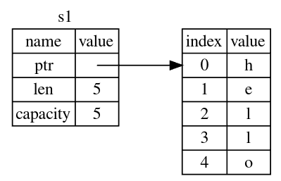
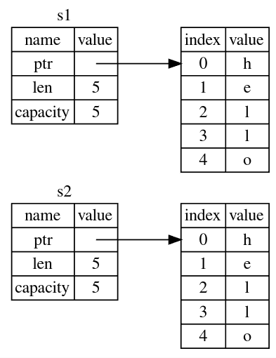
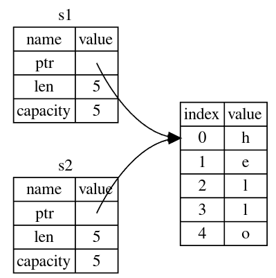
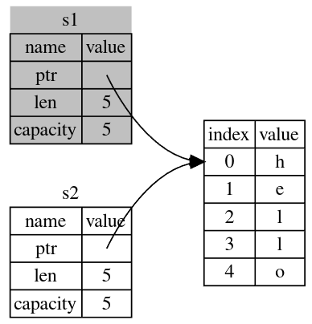
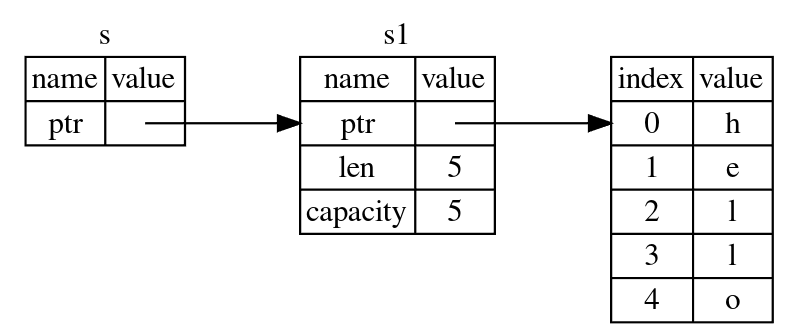

# Understanding Ownership

*   Pushing to the stack is faster than allocating on the heap
*   Accessing data in the heap is slower than accessing data on the stack because you have to follow a pointer to get there
*   When your code calls a function, the values passed into the function (including, potentially, pointers to data on the heap) and the function’s local variables get pushed onto the stack. When the function is over, those values get popped off the stack.
*   There can only be one owner of a value at a time
*   When owner goes out of scope, the value will be dropped

## The String Type

*   We use string literals(str) to store data that is known at compile time else we use the "String" type

*   `String` can be mutated but not literals

*   With the String type, in order to support a mutable, growable piece of text, we need to allocate an amount of memory on the heap, unknown at compile time, to hold the contents. This means:

    *   The memory must be requested from the memory allocator at runtime.
    *   We need a way of returning this memory to the allocator when we’re done with our String.
    *   That first part is done by us: when we call String::from, its implementation requests the memory it needs.

*   Common Methods

    *   `variable.push_str(", world!");`

     <!-- TODO: Add more -->

*   Let's look at the ways variables and data interact

    ```rust
    fn main() {
        let s1 = String::from("hello");
        let s2 = s1;
    }
    ```

*   This is how the memory representation looks like for:

    ```rust
    let s1 = String::from("hello");
    ```

    

*   This is how the memory representation would look like if you clone `s1` i.e.

    ```rust
    let s2 = s1.clone()
    ```

    

*   If the memory representation looked like below then that would be a bug. When one of the variables goes out of scope and the value is dropped, the other variable would still be pointing at that value which was dropped.

    

*   The correct memory representation would like like this instead. `s1` is moved into `s2` and is no longer valid.

    

*   Scalar types like `bool`, `u32`, `(u32, f64)`, etc. implement the `Copy` trait.

*   The code below works and `x` wasn't moved into `y` because the size of types like integers is known at compile time so they are stored on stack.

```rust
#fn main() {
    let x = 5;
    let y = x;

    println!("x = {}, y = {}", x, y);
#}
```

## Ownership and Functions

The mechanics of passing a value to a function are similar to those when assigning a value to a variable.

```rust
fn main() {
    let s1 = gives_ownership();         // gives_ownership moves its return
                                        // value into s1

    let s2 = String::from("hello");     // s2 comes into scope

    let s3 = takes_and_gives_back(s2);  // s2 is moved into
                                        // takes_and_gives_back, which also
                                        // moves its return value into s3
} // Here, s3 goes out of scope and is dropped. s2 was moved, so nothing
  // happens. s1 goes out of scope and is dropped.

fn gives_ownership() -> String {             // gives_ownership will move its
                                             // return value into the function
                                             // that calls it

    let some_string = String::from("yours"); // some_string comes into scope

    some_string                              // some_string is returned and
                                             // moves out to the calling
                                             // function
}

// This function takes a String and returns one
fn takes_and_gives_back(a_string: String) -> String { // a_string comes into
                                                      // scope

    a_string  // a_string is returned and moves out to the calling function
}
```

## References and Borrowing

*   All references are stored on the stack. Although you can store references on
    the heap, you might need another reference to refer to it. Basically, you need a
    reference to refer to anything on the heap.
*   Unlike a pointer, a reference is guaranteed to point to a valid value of a particular type for the life of that reference.

```rust
fn main() {
    let s1 = String::from("hello");

    let len = calculate_length(&s1);

    println!("The length of '{}' is {}.", s1, len);
}

fn calculate_length(s: &String) -> usize { // s is a reference to a String
    s.len()
} // Here, s goes out of scope. But because it does not have ownership of what
  // it refers to, it is not dropped.
```

*   The memory representation for the above code looks like:



*   We will look at dereferencing(`*`) in later chapters <!-- TODO: Add a link to the dereference operator chapter -->

*   To modify a borrowed value, make a reference mutable

*   [This Section](https://doc.rust-lang.org/book/ch04-02-references-and-borrowing.html#mutable-references) from the book marks the point of confusion

*   If you have a mutable reference to a value, you can have no other references to that value.

```rust
fn main() {
    let mut s = String::from("hello");

    let r1 = &mut s;
    let r2 = &mut s;

    println!("{}, {}", r1, r2);
}
```

Error:

```console
$ cargo run
   Compiling ownership v0.1.0 (file:///projects/ownership)
error[E0499]: cannot borrow `s` as mutable more than once at a time
 --> src/main.rs:5:14
  |
4 |     let r1 = &mut s;
  |              ------ first mutable borrow occurs here
5 |     let r2 = &mut s;
  |              ^^^^^^ second mutable borrow occurs here
6 |
7 |     println!("{}, {}", r1, r2);
  |                        -- first borrow later used here

For more information about this error, try `rustc --explain E0499`.
error: could not compile `ownership` due to previous error
```

The benefit of having this restriction is that Rust can prevent data races at compile time. A data race is similar to a race condition and happens when these three behaviors occur:

*   Two or more pointers access the same data at the same time.
*   At least one of the pointers is being used to write to the data.
*   There’s no mechanism being used to synchronize access to the data.

As always, we can use curly brackets to create a new scope, allowing for multiple mutable references, just not simultaneous ones:

```rust
fn main() {
    let mut s = String::from("hello");

    {
        let r1 = &mut s;
    } // r1 goes out of scope here, so we can make a new reference with no problems.

    let r2 = &mut s;
}
```

Rust enforces a similar rule for combining mutable and immutable references.

```rust
fn main() {
    let mut s = String::from("hello");

    let r1 = &s; // no problem
    let r2 = &s; // no problem
    let r3 = &mut s; // BIG PROBLEM

    println!("{}, {}, and {}", r1, r2, r3);
}
```

Error:

```console
$ cargo run
   Compiling ownership v0.1.0 (file:///projects/ownership)
error[E0502]: cannot borrow `s` as mutable because it is also borrowed as immutable
 --> src/main.rs:6:14
  |
4 |     let r1 = &s; // no problem
  |              -- immutable borrow occurs here
5 |     let r2 = &s; // no problem
6 |     let r3 = &mut s; // BIG PROBLEM
  |              ^^^^^^ mutable borrow occurs here
7 |
8 |     println!("{}, {}, and {}", r1, r2, r3);
  |                                -- immutable borrow later used here

For more information about this error, try `rustc --explain E0502`.
error: could not compile `ownership` due to previous error
```

Whew! We also cannot have a mutable reference while we have an immutable one to the same value.

Users of an immutable reference don’t expect the value to suddenly change out from under them! However, multiple immutable references are allowed because no one who is just reading the data has the ability to affect anyone else’s reading of the data.

Note that a reference’s scope starts from where it is introduced and continues through the last time that reference is used. So this code compiles:

```rust
fn main() {
    let mut s = String::from("hello");

    let r1 = &s; // no problem
    let r2 = &s; // no problem
    println!("{} and {}", r1, r2);
    // variables r1 and r2 will not be used after this point

    let r3 = &mut s; // no problem
    println!("{}", r3);
}
```

## Dangling References

```rust
fn main() {
    let reference_to_nothing = dangle();
}

fn dangle() -> &String { // dangle returns a reference to a String

    let s = String::from("hello"); // s is a new String

    &s // we return a reference to the String, s
} // Here, s goes out of scope, and is dropped. Its memory goes away.
  // Danger!
```

Error:

```console
$ cargo run
   Compiling ownership v0.1.0 (file:///projects/ownership)
error[E0106]: missing lifetime specifier
 --> src/main.rs:5:16
  |
5 | fn dangle() -> &String {
  |                ^ expected named lifetime parameter
  |
  = help: this function's return type contains a borrowed value, but there is no value for it to be borrowed from
help: consider using the `'static` lifetime
  |
5 | fn dangle() -> &'static String {
  |                ~~~~~~~~

For more information about this error, try `rustc --explain E0106`.
error: could not compile `ownership` due to previous error

```

More specifically:

```console
this function's return type contains a borrowed value, but there is no value
for it to be borrowed from
```

## Slice Type: Different kind of references

Let's write a program to output the first word of a string:

```rust
{{#rustdoc_include ../listings/04_understanding_ownership/l01-get-first-word-index/src/main.rs:all}}
```

<details>
<summary>Output</summary>

```console
{{#include ../listings/04_understanding_ownership/l01-get-first-word-index/output.txt}}
```

</details>

*   In the above program `word` still holds the value `3` which is meaningless after
    the `String` gets cleared. If we use `word` further, our program will panic.

*   This can be avoided if our function returned a slice.

```rust
{{#rustdoc_include ../listings/04_understanding_ownership/l02-get-first-word-slice/src/main.rs:all}}
```

<details>
<summary>Error</summary>

```console
{{#include ../listings/04_understanding_ownership/l02-get-first-word-slice/output.txt}}
```

</details>

*   The above program doesn't compile

*   If we have a string slice, we can pass that directly. If we have a String, we can pass a slice of the String or a reference to the String. This flexibility takes advantage of deref coercions, a feature we will cover in the [ "Implicit Deref Coercions with Functions and Methods" ](https://doc.rust-lang.org/book/ch15-02-deref.html#implicit-deref-coercions-with-functions-and-methods) section of Chapter 15.

*   This program can also be improved by using `&str` instead of `&String` in the function signature.

*   Defining a function to take a string slice instead of a reference to a String makes our API more general and useful without losing any functionality

### Other Slices

We can use slices to refer to part of an array:

```rust
{{#rustdoc_include ../listings/04_understanding_ownership/l03-other-slices/src/main.rs:all}}
```

In the above program both `&[2, 3]` and `[2, 3]` because.

[](https://doc.rust-lang.org/stable/std/primitive.array.html#impl-PartialEq<%26\[B]>-for-\[A%3B%20N])
